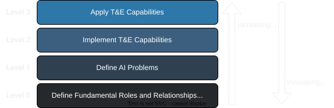
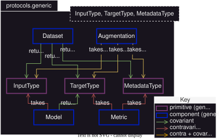
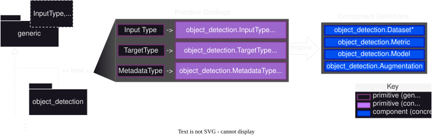
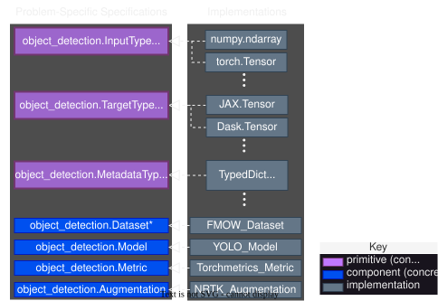

.. _maite_layered_architecture:

========================================
MAITE Layered Architecture
========================================

MAITE provides an extensible test and evaluation (T&E) architecture organized into layers that each serve distinct purposes.
This page explains how these layers are organized to enable interoperability and extensibility across AI problems. 

In the remainder of this explainer, we make heavy use the terms "primitive", "component", and "task" according to the MAITE-specific definitions provided in :ref:`components_tasks_primitives`.

Overview
========

MAITE's architecture comprises four layers that build on one another.

   **MAITE's Layered Architecture**

   Four layers from fundamental definitions (Level 0) to concrete applications (Level 3).

This layered approach supports users at multiple levels while keeping the MAITE library extensible to new problem types and T&E capabilities.
(See discussion of different MAITE user types is given in :ref:`maite_users`. [#practical_layer_spanning_caveat]_)

.. At level 3, application-driven developers can spend their time in their concrete problem space, benefitting from existing capabilities that conform to MAITE's open standards, while being able to build custom pipelines or application-specific capabilities of their own.
.. At level 2, capability developers can focus on implementing components within an AI-problem specification, or define a new AI problem and enrich MAITE's ecosystem.
.. At levels 1 and 0, MAITE developers can define or promote AI problem definitions into the MAITE library while continually updating MAITE's structure based on real mission experience gleaned from concrete user experiences.

Level 0: Define Roles of Fundamental Primitives and Components
===============================================================

The foundational layer defines fundamental roles and relationships between primitives and components in supervised AI/ML. 
This layer establishes the core abstractions that remain consistent across all AI problems. [#polymorphic_tasks]_
The architecture is built on the observation that supervised AI problems almost always conform to the structure of a mapping between primitive types.
By using generics, MAITE can define the type-blind relationships between primitives and components in a given problem.

   **Level 0: Primitive and Component Fundamental Roles**

   Generic primitives (InputType, TargetType, MetadataType) and components
   (:py:class:`~maite.protocols.generic.Model`, :py:class:`~maite.protocols.generic.Metric`, :py:class:`~maite.protocols.generic.Augmentation`, :py:class:`~maite.protocols.generic.Dataset` [#dataloader_layer0]_) with their relationships.

**Outcomes**

- **Globally consistent component/primitive relationships**: All AI problems use the
  same component structure, just with different concrete types.

- **Architectural openness to new AI problems**: New problems can be added by defining
  new primitive types without modifying the core framework.

- **Facilitation of problem-agnostic utilities**: Generic tasks like evaluation and
  prediction can work across multiple AI problems because they operate on the common
  component structure.

Level 1: Define AI Problems
===========================

This layer specializes the generic primitives and components for specific AI problem types.
An AI problem is defined by choosing concrete types for the three primitives and specifying behavioral expectations. [#behavioral_layer1]_

   **Level 1: AI Problem Definition**

   Specializing generic protocols for the object detection AI problem. [#shape_value_semantics]_

The process of defining an AI problem in MAITE comprises 3 steps. [#doing_versus_doing_well]_

1. **Specify primitive types**

   MAITE uses a three-layer type alias system to separate what a type technically is (inherent type) from what it means in the domain (semantic alias) and where it appears in protocols (role alias):

   .. code-block:: text

      Inherent Type → Semantic Alias → Role Alias
      
      Example
      --------
        ArrayLike   →      Image       →     InputType
      (Python type)   (domain meaning)   (protocol position)

   This convention allows the runtime type to be the best available fit from the Python language (e.g., :py:class:`~maite.protocols.ArrayLike`), while docstrings on semantic and role aliases provide context-specific behavioral expectations for use within a particular AI problem.

   **Why use multiple aliases for the same type?**

   A single underlying type like :py:class:`~maite.protocols.ArrayLike` can represent many different domain concepts—an image, a bounding box, a segmentation mask, a feature vector. Each semantic alias captures different behavioral expectations through its docstring:

   - :py:type:`~maite.protocols.image_classification.Image`: ArrayLike with shape (C, H, W), values in [0, 255] or [0, 1]
   - ``SegmentationMask``: ArrayLike with shape (H, W), integer class IDs
   - :py:type:`~maite.protocols.image_classification.ImgClassification`: ArrayLike with shape (Cl,), probability distribution

   Role aliases (``InputType``, ``TargetType``, ``DatumMetadataType``) then specify which semantic type occupies which position in generic protocols, making protocol signatures both generic and self-documenting.

   **Example from image classification:**

   See :ref:`api_image_classification` for a complete example. Key type definitions:

   .. code-block:: python

      # Assuming inherent type of ArrayLike

      # Semantic alias (domain meaning)
      Image: TypeAlias = ArrayLike
      """Semantic alias for a single image datum.
      Expected shape semantics: (C, H, W)"""

      ImgClassification: TypeAlias = ArrayLike
      """Semantic alias for a classification target/prediction vector.
      Expected shape semantics: (Cl,) where Cl is number of classes"""

      # Role aliases (protocol positions)
      InputType: TypeAlias = Image
      """Role alias for model/dataset input in the image-classification protocol family."""

      TargetType: TypeAlias = ImgClassification
      """Role alias for model/dataset target in the image-classification protocol family."""

      DatumMetadataType: TypeAlias = DatumMetadata
      """Role alias for datum-level metadata in image-classification protocol signatures."""

   When defining a new AI problem, specify:

   - **InputType**: What the model consumes (e.g., Image, Text, Audio)
   - **TargetType**: What the model predicts (e.g., ObjectDetectionTarget, Label, Transcript)
   - **DatumMetadataType**: Information for stratifying analysis, not provided to model

2. **Parametrize generic component protocols**

   Parameterize the generic component protocols with the chosen primitive types:

   .. code-block:: python

      # Generic protocol from Layer 0
      from maite.protocols import generic as gen
      from maite.protocols import object_detection as od

      class Model(Protocol, Generic[InputT, TargetT]):
          def __call__(self, inputs: Sequence[InputT]) -> Sequence[TargetT]: ...

      # Specialized for object detection
      from maite.protocols import object_detection as od

      class Model(gen.Model[Image, od.ObjectDetectionTarget], Protocol):
          """Object detection model protocol"""
          ...

3. **Explicitly document behavioral expectations on primitive semantic aliases**

   Specify semantic expectations on primitives in docstrings, especially those that cannot be enforced by a Python static type checker [#behavioral_layer1]_—for example, image shape conventions (C, H, W), bounding box formats [x0, y0, x1, y1], coordinate systems (origin at top-left), or probability constraints (scores sum to 1.0).
   MAITE makes a practice of doing this at the class docstring level for transparency and consistency.

Example: Object Detection
--------------------------

The object detection AI problem specializes:

- **InputType = Image**: :py:class:`~maite.protocols.ArrayLike` with shape (C, H, W)
- **TargetType = ObjectDetectionTarget**: :py:type:`~maite.protocols.object_detection.ObjectDetectionTarget` with boxes, labels, scores attributes
- **MetadataType = DatumMetadata**: :py:class:`~maite.protocols.DatumMetadata` TypedDict with required 'id' field

Components inherit these types:

- :py:class:`~maite.protocols.object_detection.Dataset`: Provides (Image, ObjectDetectionTarget, DatumMetadata) tuples
- :py:class:`~maite.protocols.object_detection.Model`: Maps Sequence[Image] → Sequence[ObjectDetectionTarget]
- :py:class:`~maite.protocols.object_detection.Metric`: Evaluates ObjectDetectionTarget predictions

**Outcomes**

- **AI problem specification**: Structural types encoding behavioral expectations for
  components and primitives

- **Extensibility and interoperability**: Over different primitive, component, and task
  implementations

Level 2: Implement T&E Capabilities
====================================

This layer provides concrete implementations that satisfy the AI problem protocols defined in the preceding level.
Implementations can come from MAITE itself [#interop_namedrop]_, third-party libraries, or user code.

   **Level 2: T&E Capability Implementations**

   Concrete implementations satisfying object detection protocols. [#shape_value_semantics]_ [#maite_task_omission]_

Primitive Implementations
-------------------------

Problem-specific primitive types are implemented using concrete structures:

**InputType (Image)**:
   - numpy.ndarray
   - torch.Tensor
   - jax.Array
   - dask.array.Array
   - Any :py:class:`~maite.protocols.ArrayLike` type

**TargetType (ObjectDetectionTarget)**:
   - Custom classes implementing the protocol
   - Dataclasses with required attributes
   - Dictionaries satisfying structural requirements

**MetadataType (DatumMetadata)**:
   - TypedDict with optional extra fields
   - Plain dictionaries satisfying required structure

Component Implementations
-------------------------

Concrete components satisfy the protocols through structural compatibility:

- **Datasets**: COCO dataset wrappers, Torchvision datasets, custom dataset classes
- **Models**: YOLO models, Faster R-CNN, custom detection models
- **Metrics**: COCO metrics, precision/recall calculators, custom evaluators
- **Augmentations**: Image transformations, data augmentation pipelines

Implementations need not explicitly inherit from MAITE protocols.
They satisfy protocols through structural subtyping—having the required methods and attributes with compatible type signatures.

**Outcomes**

- **Concrete and interoperable component and task implementations** that can be applied across applications within the same AI problem

Level 3: Apply T&E Capabilities
================================

The top layer represents concrete applications: using implemented components to perform test and evaluation tasks.
This is where users compose components to generate predictions and evaluate models.

Applications at this layer have:

- **Rich problem context**: Specific datasets, particular model architectures, concrete
  evaluation requirements
- **Concrete instantiations**: Actual Python objects (not protocols or type variables)
- **Executable workflows**: Running evaluation pipelines, generating predictions,
  computing metrics

.. code-block:: python

   # Level 3: Application code
   from maite.protocols import object_detection as od
   from maite.tasks import evaluate

   # Concrete implementations
   dataset = MyCOCODataset()      # Satisfies od.Dataset
   model = MyYOLOModel()          # Satisfies od.Model
   metric = MyCOCOMetric()        # Satisfies od.Metric

   # Apply T&E capability
   results = evaluate(model, dataset, metric)

The three layers below (Levels 0-2) together form the complete foundation, with Level 3
representing any concrete application that composes these capabilities.

**Outcomes**

- Application-level T&E results inform next steps in application-level MLOps process
  
- Enables lower levels of MAITE architecture to selectively promote/adapt elements that would be useful in other applications. These could be in the same AI problem (corresponding to updates at layer 2) or more broad (corresponding to updates at layers 0 and/or 1).

Further Reading
===============

- :ref:`maite_users` - MAITE user types and how they interact with each layer
- :ref:`api_generic` - Generic protocol API reference (Layer 0)
- :ref:`maite-vision` - Overall vision document
.. - :ref:`define-new-ai-problem` - How to define a new AI problem (Layer 1)

Footnotes
=========

.. [#practical_layer_spanning_caveat] In practice, specific users may very easily work across multiple layers, but considering more narrowly defined user categories is helpful for explanation.

.. [#polymorphic_tasks] This lowest level of structure that is agnostic of AI problem enables MAITE tasks that are agnostic of problem type (polymorphic over AI problems), but still checked by a static typechecker for compatibility.

.. [#shape_value_semantics] Behavioral Expectations beyond what is visible to a static type-checker should be at least documented, and may include opt-in runtime verification routines tied to problem-specific primitive types.

.. [#maite_task_omission] MAITE tasks are not depicted because they are a fundamentally more open concept and are not backed by structural types.

.. [#doing_versus_doing_well] While definition may be a simple enough process, doing so well can be much harder; The MAITE development team would hope the examples of AI problem type definitions (exposed via named subpackages in `maite.protocols`) are useful starting points.

.. [#dataloader_layer0] The `DataLoader`` component exhibits similar variance with respect to type variables; it is omitted for brevity in these diagrams.

.. [#behavioral_layer1] Behavioral expectations beyond what is visible to a static type checker should be at least documented, and may include opt-in runtime verification routines tied to problem-specific primitive types.

.. [#interop_namedrop] This is often via the `interop` submodule that provides adaptors for popular AI libraries.
