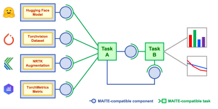

.. raw:: html

   

.. role:: bolditalic
   :class: bolditalic

MAITE's Vision for Interoperability in AI Test and Evaluation
-------------------------------------------------------------

The Problem
===========

The landscape of open source AI test and evaluation (T&E) tools is expansive and constantly growing -- not only in terms of the variety of components available (models, datasets, augmentations, and metrics), but also in terms of library authors, frameworks (e.g., PyTorch, Tensorflow, JAX), modalities (e.g., images, sound, text, internet traffic), AI problems (e.g., image classification, object detection, text classification), and applications (e.g., cat identification, network activity classification, facial recognition).

This highly dynamic ecosystem of T&E tools has tremendous potential, but the breadth of options available can easily become a liability that hinders or halts integration efforts.
Separately-developed software tools that work on the same problem rarely work seamlessly together, creating a need for ad-hoc compatibility shims that can be time consuming, fragile, or poorly documented.
Can model X be used with dataset Y after augmentation Z to test performance with respect to metrics A, B, and C?
The answer is typically yes, but requires a fair amount of translation from the integrator of all these components that is specific to their task.

This is the problem that MAITE is trying to solve within the JATIC ecosystem of AI T&E Python libraries.
The standards introduced by MAITE are meant to enable broad interoperability between components while requiring relatively little of component implementers and even less of those integrating JATIC libraries together in pipelines.
MAITE aims to induce a virtuous feedback cycle within the JATIC ecosystem; as the benefit of leveraging MAITE-compatible components increases, the number of ecosystem users increases and so does the supply of MAITE-compatible components.
This dynamic sets up the JATIC ecosystem to be a rich, modular, and extensible supply of tools that enables developers to rapidly assemble reusable and highly-customized T&E procedures.

Above: MAITE standards permit compatible components and tasks to be reused in multiple T&E pipelines with minimal shim code written by an integrator.

Design Objectives
=================

The design of the MAITE standard is structured around the following objectives:

1) **Modularity/Substitutability** - Two functional components that meet the same expectations should be mutually substitutable in a T&E procedure.
2) **Extensibility** - New functional components should be authorable by anyone and require minimal outside imports.
3) **Simplicity** - Expectations comprising the MAITE standard should be as simple as possible to promote implementation of MAITE-compliant AI components, while still being detailed enough to provide useful guarantees to those integrating AI components within a T&E workflow.
4) **Safety** - Compatibility of AI components should be clear, and compatible components should be usable together as expected.
5) **Reproducibility** - The MAITE standard should make AI T&E pipelines easily reproducible to support future updates or result audits. [#reproducibility]_

.. _components_tasks_primitives:

Interoperable Object Concepts: "Components", "Tasks", and "Primitives"
======================================================================

In the context of AI T&E libraries, the term "component" may be referring to AI-relevant objects (e.g., a Model, Dataset, Metric, etc.) or simply AI-relevant procedures (e.g., ``augment_dataloader(...)``, ``evaluate_model(...)``, etc.).
MAITE provides AI-task-specific [#mltask]_ behavioral expectations [#behavioral_expectations]_ for several recognizable objects [#ml_component_list]_ and refers to objects meeting one of these definitions as "MAITE components".
Alternatively, procedures ("callables" in Python nomenclature) that accept and return (arbitrary) [#arbitrary]_ MAITE component implementers are termed "MAITE tasks".

To be more precise, more rigorous definitions are included below:

**MAITE component**
  Implementer of a MAITE-defined Python protocol class (Dataloader, Dataset, Augmentation, Model, or Metric) that follows prescribed semantics [#protocol_classes]_

**MAITE task**
  A Python callable that:

  * accepts only arguments typed as MAITE components [#includes_containers]_ or MAITE primitives [#includes_containers]_
  * returns MAITE components [#includes_containers]_, MAITE primitives [#includes_containers]_, and/or Python objects of built-in/broadly-accepted [#common_structures]_ types with well-documented semantics [#non_consumables]_

**MAITE primitive**
  Object with class and semantics of a member variable type, argument type, or return type of a MAITE-defined Python protocol class

Defining these abstractions is useful because they permit quantifying a library's broader interoperability in a simple and accurate way: :bolditalic:`interoperability is the degree to which a library exposes MAITE components and MAITE tasks`.
That's it. Regardless of a library's potentially complex inner workings, a highly-interoperable library should expose such components and tasks to enable broad interoperability for integrators.

Structural Subtypes and Static Type Checking: Mechanisms for Defining and Verifying Standards
=============================================================================================

In the case of MAITE components, behavioral expectations are defined using Python structural types (viz. ``Protocol`` classes and ``TypedDict`` classes [#python_structural_types]_) and verified using a static type checker. [#pyright]_
The Python structural types provide strict, consistent, and machine-readable definitions of MAITE components that specify minimum expected member variable names, member variable types, method names, and method type signatures.
The MAITE-provided structural type definitions permit static type checkers to verify Python objects fulfill required behavioral expectations at development time whenever the object is assigned to an object type hinted as the MAITE structural type. [#assignability]_
After assignment to the structural type and validation by a typechecker, downstream procedures can treat the object as an arbitrary instance of the broader structural type without regard for specific implementation details.

In practice, MAITE defines five component types within each supported AI problem.
These are ``Dataset``, ``DataLoader``, ``Augmentation``, ``Model``, and ``Metric``. A high-level UML class diagram of MAITE components (these are the classes with the "protocol" stereotype applied) is shown below.
The diagram is templated on types which vary based on AI problem.

.. image:: ../_static/images/maite_class_diagram.svg
    :width: 800
    :align: center

As the diagram is depicting, each component protocol implies certain behavioral expectations.

* ``Dataset`` components provide random access to individual data points, which comprise a tuple of input, target, and datum-specific metadata.
* ``DataLoader`` components support iteration and yield sequential access to batches of data points.
* ``Augmentation`` components take, modify, and return batches of data.
* ``Model`` components take batches of inputs and return batches of targets.
* ``Metric`` components compute alignment metrics between two batches of targets (one representing predictions and the other representing ground truth).

Note: MAITE tasks do not currently use structural types for definition or verification.
As they take and return a variable number of arguments, they are too open a construct to have their definition backed by a particular Python structural type.

Footnotes
==========

.. [#reproducibility] Currently, no standards exist on how pipelines should be constructed, and thus no centralized record-keeping construct exists. This is nonetheless a goal that we'd like the MAITE protocols to enable.

.. [#mltask] A specific AI problem will have the types of model inputs, model predictions, minimum datum metadata, and batching procedure all defined.

.. [#behavioral_expectations] Instead of the clunky-but-accurate phrase "expected object semantics, variable names, variable types, method names, and method type signatures" we often will use "behavioral expectations" or "behavioral contract" which is shorter, but more abstract. If an object meets or exceeds behavioral expectations of a given component protocol, it is termed an "implementer" of that protocol and will pass static type checking when type hinted as the protocol type (even without nominal inheritance, because protocols are structural types [#python_structural_types]_).

.. [#ml_component_list] viz. ``Dataset``, ``Dataloader``, ``Augmentation``, ``Model``, ``Metric``

.. [#arbitrary] The "arbitrary" modifier is necessary if we care about callable interoperability because a callable that doesn't accept *certain* varieties of MAITE-conforming AI objects isn't generally interoperable. It doesn't accept MAITE-conforming AI objects per se, only more specialized structures that happen to be MAITE-conforming. This is a consequence of callable type contravariance with respect to argument types.

.. [#protocol_classes] In practice, these contracts are defined using Python classes that obey structural subtyping (viz. Python protocol classes or Python ``TypedDict`` classes). All object variables, methods, and type signatures can be checked via a static type checker. Semantic conditions of these contracts cannot be checked via a static type checker, but are documented in the protocol class definitions themselves.

.. [#includes_containers] This includes built-in containers thereof.

.. [#common_structures] This includes numpy.ndarray, pandas.Series, and pandas.DataFrame.

.. [#non_consumables] The use of this last return type precludes downstream consumption by other MAITE tasks.

.. [#python_structural_types]  In structural types (as opposed to nominal types), object subtyping relationships are determined from member variables and method type signatures (i.e., "how the object behaves"), rather than nominal inheritance (i.e., an object's "ancestry"). This means that structural types can be used to define some behavioral expectations for an object. See the Python typing spec for more details: https://typing.readthedocs.io/en/latest/spec/concepts.html#nominal-and-structural-types

.. [#pyright] MAITE recommends the Pyright static type checker: https://microsoft.github.io/pyright/#/

.. [#assignability] Type checkers validate any assignment to a type hinted variable. This object's assignability to a type hinted variable is tested when (a) arguments are provided to a callable (because an object is assigned to a type hinted argument), (b) values are returned from a callable (because an object is assigned to a type hinted return value), or in simple assignment. See Python typing spec glossary `"assignable" entry <https://typing.readthedocs.io/en/latest/spec/glossary.html#term-assignable>`_ or the section on `protocol assignability to other types <https://typing.readthedocs.io/en/latest/spec/protocol.html#assignability-relationships-with-other-types>`_